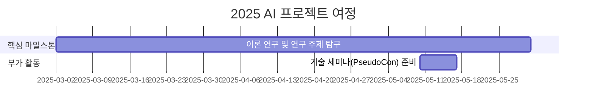

# Generative AI in Drug Design Lab

<h1 align="center"> Generative AI in Drug Design Lab </h1>

<div align="center">
<a href="https://pseudo-lab.com"></a>
<a href="https://discord.gg/EPurkHVtp2"></a>
<a href="https://github.com/Pseudo-Lab/GenAIDD/stargazers"></a>
<a href="https://github.com/Pseudo-Lab/GenAIDD/network/members"></a>
<a href="https://github.com/Pseudo-Lab/GenAIDD/pulls"></a>
<a href="https://github.com/Pseudo-Lab/GenAIDD/issues"></a>
<a href="https://github.com/Pseudo-Lab/GenAIDD/graphs/contributors"></a>
<a href="https://hits.seeyoufarm.com"></a>
</div>
<br>

<!-- sheilds: https://shields.io/ -->
<!-- hits badge: https://hits.seeyoufarm.com/ -->

> Welcome to  Generative AI in Drug Design Lab repository! We aim to organize recent papers related with generative AI in drug discovery, We are planning to offer tools and frameworks for generating molecules, benchmark, and visualized analysis. Join us in advancing the field of generative AI through open collaboration and innovation!

## 🌟 프로젝트 목표 (Project Vision)
_"이론에서 실전까지, 함께 성장하는 AI 실험실"_  
- Drug Design에 활용되는 Generative Model 에 대한 스터디 및 프로젝트
- 개인 성장과 집단 지혜의 시너지 창출
- 오픈소스 정신을 바탕으로 한 지식 공유 문화
- 실패를 성공의 디딤돌로 만드는 실험적 접근

### Introduction: 이번 시즌 스터디 목표 
- 제약분야에서는 어떤 문제를 풀까? 어떤 기술이 어느 부분에 적용되고 있나?
- 각 문제를 Data, Model의 문제로 환원하는 방법
- 최신 연구의 trend. 앞으로 심도있게 연구할 분야 선정

## 🧑 역동적인 팀 소개 (Dynamic Team)

| 역할          | 이름 |  기술 스택 배지                                                                 | 주요 관심 분야                          |
|---------------|------|-----------------------------------------------------------------------|----------------------------------------|
| **Project Manager** | [최호재](https://www.linkedin.com/in/hojae-m-choi) |   | 생성형 AI, 연구, 웹서비스 구축             |
| **Member** | [김수빈](https://www.linkedin.com/in/sucong2/) |  | 생성형 AI, 웹/앱 서비스 구축 및 운영 |
| **Member** | [김예준](https://www.linkedin.com/in/ye-jun-kim-yerdy) |  | 생성형 AI |
| **Member** | ??? |  |  |
| **Member** | ??? |  |  |


## 🚀 프로젝트 로드맵 (Project Roadmap)



## 🛠️ 우리의 개발 문화 (Our Development Culture)
**우리의 개발 문화**  
```python
class CollaborationFramework:
    def __init__(self):
        self.tools = {
            'communication': 'Discord',
            'version_control': 'GitHub Projects',
            'ci/cd': 'GitHub Actions',
            'docs': 'Github Wiki'
        }
    
    def workflow(self):
        return """주간 사이클:
        1️⃣ 월요일: 논문 리뷰 발표 (Github & Notion 타임라인 공유)
        2️⃣ 화요일: 발표 후기 올리기 (본인의 blog --> Github 에 공유)
        3️⃣ 수요일: 발표 홍보 하기 (본인의 SNS 계정에 발표글 링크를 걸어서 소개하기)"""
```


## 📈 성과 지표 (Achievement Metrics)
**2025 주요 KPI**  
| 지표                     | 목표치 | 현재 달성률 |
|--------------------------|--------|-------------|
| 기술 블로그 게시물       | 24편   | 0편        |
| 리뷰한 논문 수          | 20편   | 0편        |
<!-- | 커밋 수                  | 1,200  | 0%         | -->
<!-- | 이슈 해결률              | 95%    | 0%         |  -->
<!-- | 오픈소스 기여도          | 8회    | 0회         | -->


## 💻 주차별 활동 (Activity History)

| 날짜 | 내용 | 발표자 | 참고자료 |
| -------- | -------- | ---- | --- | 
| 2025/03/03 | OT - 제약분야에서 사용되는 다양한 모델들과 생성형 AI 소개 |     |  - |
| 2025/03/10 | 논문 리뷰 - Diffusion 1                | 미정 |  선정 중 |
| 2025/03/17 | 논문 리뷰 - Diffusion 2                | 미정 |  선정 중 |
| 2025/03/24 | Magical Week 휴일                     | 미정 |  - |
| 2025/03/31 | 논문 리뷰 - Diffusion 3                |  미정 |  선정 중 |
| 2025/04/07 | 논문 리뷰 - Generative Flow Network 1 |  미정 |  선정 중 |
| 2025/04/14 | 논문 리뷰 - Generative Flow Network 2 |  미정 |  선정 중 |
| 2025/04/21 | 논문 리뷰 - Generative Flow Network 3 |  미정 |  선정 중 |
| 2025/04/28 | Magical Week 휴일                    |  미정 |  - |
| 2025/05/05 | 논문 리뷰 - Score-based Method 1 |  미정 |  선정 중 |
| 2025/05/12 | 논문 리뷰 - Score-based Method 2 |  미정 |  선정 중 |
| 2025/05/17 | PseudoCon |  - |  - |
| 2025/05/19 | 논문 리뷰 - Structure based method 1 |  미정 |  선정 중 |
| 2025/05/26 | 논문 리뷰 - Structure based method 2 |  미정 |  선정 중 |
| 2025/06/02 | 논문 리뷰 - Ligand based method 1 |  미정 |  선정 중 |
| 2025/06/09 | 논문 리뷰 - Ligand based method 2 |  미정 |  선정 중 |

## 💡 학습 자원 (Learning Resources)
**우리가 만든 지식 허브**  

### 논문 리스트 
- [List of papers](references/LIST.md)

### 참고자료
- 주: [Valence Portal](https://portal.valencelabs.com/): 제약분야에서 사용되는 최신의 모델들을 파악하고 싶을 때
- 부: [LAIDD](https://www.laidd.org/): (optional) 제약분야에 대해서 self-pace 로 학습하고 싶을 때
- 부: [amorehead/awesome-molecular-generation](https://github.com/amorehead/awesome-molecular-generation): 그나마 최근 까지 활동적인 awsome list

<!--
- [AI Playbook](https://github.com/your-org/ai-playbook): 150+ 페이지의 실전 가이드
- [MLOps Pipeline Template](https://github.com/your-org/mlops-template): 재사용 가능한 인프라 코드
- [Failure Journal](https://your-org.github.io/failure-journal): 50+개의 실패 사례 분석 [31][34]
-->

## 🌱 참여 안내 (How to Engage)

**진행 정보**
- 시간: 매주 월요일 오후 8시
- 장소: 온라인 (Pseudo Lab 디스코드 채널: `Room-YB`)

**참여 조건**
- **제약분야에 사용되는 AI, 기술이나, 제약회사 경력에 관심 있으신 분**
- 딥러닝 기초 지식 보유하신 분
- 논문을 읽고 리뷰하실 수 있는 분

**팀원으로 참여하시려면 러너 모집 기간에 신청해주세요.**  
- 링크 (준비중)  

**지원시 다음 내용을 포함해주세요**
> - 지원하신 동기 (5문장 이하로 작성해주세요.)
> - 이번 스터디를 통해 얻고자 하는 것
    - 예시) survey paper, 책, 
> - 제약분야 관련 경험 or AI/ML 관련 연구/스터디 경험

**누구나 청강을 통해 모임을 참여하실 수 있습니다.**  
1. 특별한 신청 없이 정기 모임 시간에 맞추어 디스코드 #Room-YB 채널로 입장
2. Magical Week 중 행사에 참가
3. Pseudo Lab 행사에서 만나기

## Acknowledgement 🙏

Generative AI in Drug Design Lab is developed as part of Pseudo-Lab's Open Research Initiative. Special thanks to our contributors and the open source community for their valuable insights and contributions.

## About Pseudo Lab 👋🏼</h2>

[Pseudo-Lab](https://pseudo-lab.com/) is a non-profit organization focused on advancing machine learning and AI technologies. Our core values of Sharing, Motivation, and Collaborative Joy drive us to create impactful open-source projects. With over 5k+ researchers, we are committed to advancing machine learning and AI technologies.

<h2>Contributors 😃</h2>
<a href="https://github.com/Pseudo-Lab/GenAIDD/graphs/contributors">
  
</a>
<br><br>

<h2>License 🗞</h2>

This project is licensed under the [MIT License](https://opensource.org/licenses/MIT).
